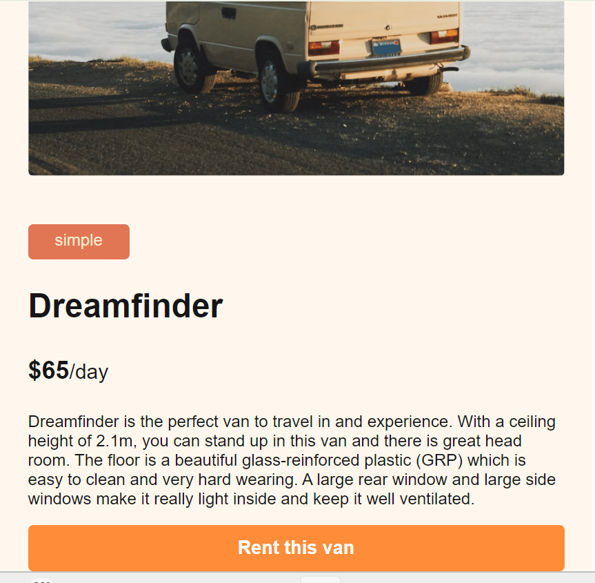
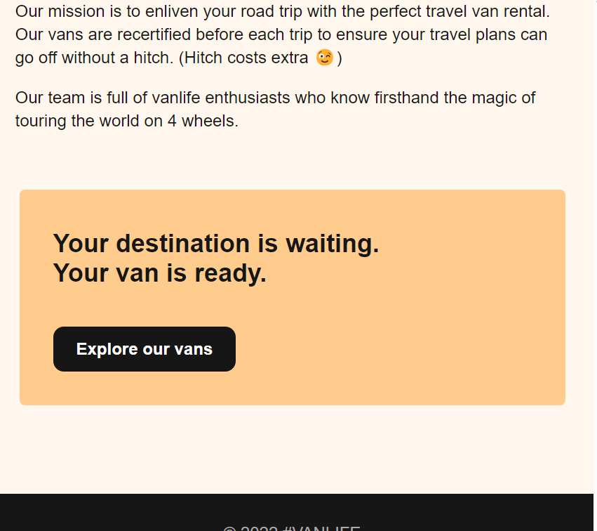

# 🚐 Van Rental App Template

A **front-end template** for a modern, full-featured **Van Rental App** — beautifully designed and fully functional on the client-side.

This template includes login flow, host dashboard, van listings, and clean routing logic. It’s perfect for learning how to build a van rental platform or kickstarting a full-stack app.

> ⚠️ **Note:** This is a **template only**. It does **not include a database or backend integration**. All data is mocked or stored temporarily (e.g., in local state or localStorage).

---

## ✨ Features

- 🔐 **Login Flow** — Simulated login page with conditional rendering
- 🧑‍💼 **Host Dashboard** — UI for managing vans (edit, view, manage)
- 🚐 **Van Listings** — List, view details, and explore available vans
- 📄 **Separate Pages** — Home, About, Host, Vans, Login, and more
- 🎨 **Modern UI/UX** — Built with great design principles, fully responsive
- 🧪 **Pure Frontend Logic** — No backend or database required
- ⚙️ **Ready to Integrate** — Easily extendable with APIs or databases

---

## 📁 Folder Structure

````


## 🧰 Tech Stack

- **React**
- **React Router**
- **CSS / Tailwind / Styled Components**
- **LocalStorage / Mock Data**
- *(No database or backend APIs included)*

---

## 🚀 Getting Started

### 1. Clone the Repo

```bash
https://github.com/Eyob-smax/VanRentalApp-React-Template.git
cd VanRent-Template
````

### 2. Install Dependencies

```bash
npm install
```

### 3. Start the Dev Server

```bash
npm run server
```

Visit [http://localhost:5173](http://localhost:5173) to explore the app!

---

## 🧠 Use Cases

- UI/UX Prototyping
- Learning Client-Side Routing and App Structure
- Frontend Practice for Beginners
- Template Base for Full-Stack Projects

---

## 📌 Future Ideas (Optional)

If you'd like to expand this into a full-stack app, consider adding:

- ✅ Backend (Node.js + Express or Remix/Next)
- ✅ Database (MongoDB, PostgreSQL, Firebase)
- ✅ Auth & Sessions
- ✅ Payment Gateways

---

## 🧑‍💻 Built By

**Eyob Simachew**  
Frontend Developer & UI Lover ✨  
[GitHub](https://github.com/Eyob-smax)

---

> 💡 “This template is a great starting point — design meets functionality, just waiting for your backend magic.”

## 🔍 App Preview

### 🏠 Home Page


### 🔐 Login Page


### 🚐 Vans Listing


### 📄 Van Detail Page



### 🧭 Explore Page



### 🖼️ UI Highlight


